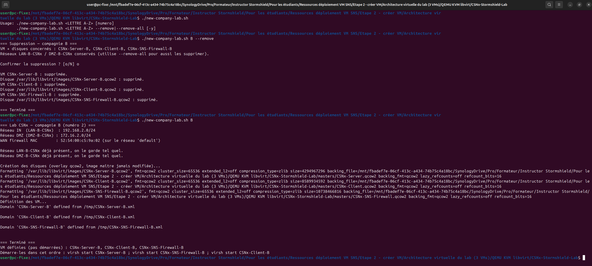
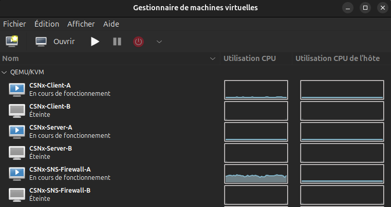
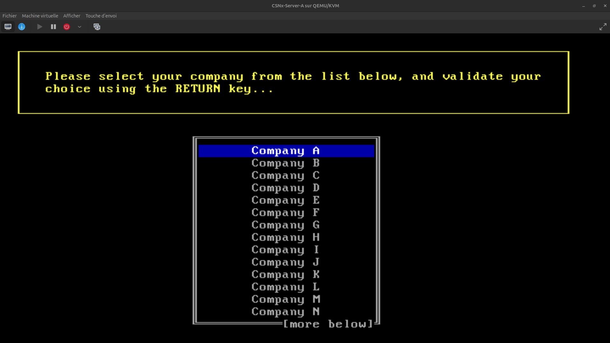
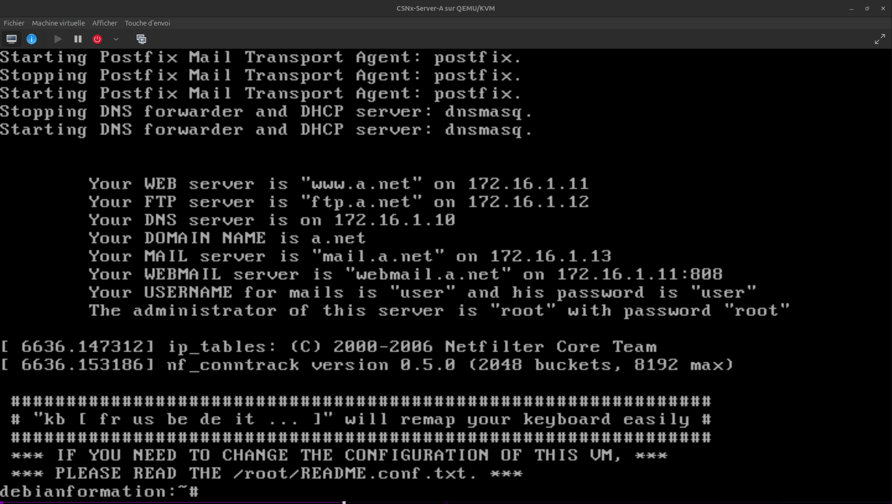
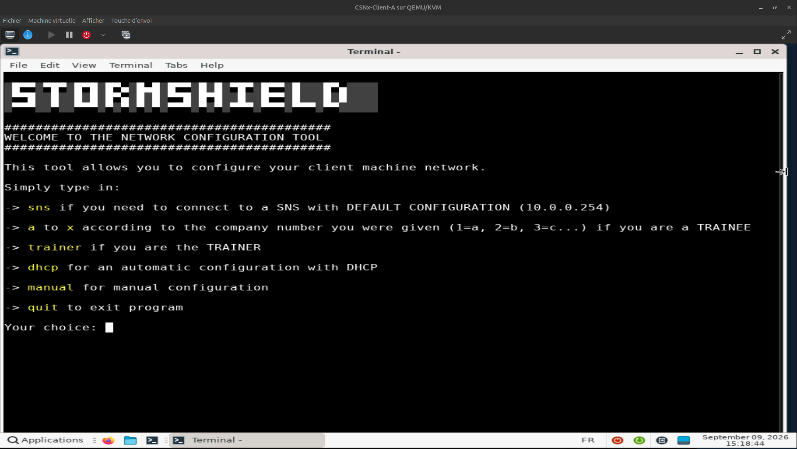
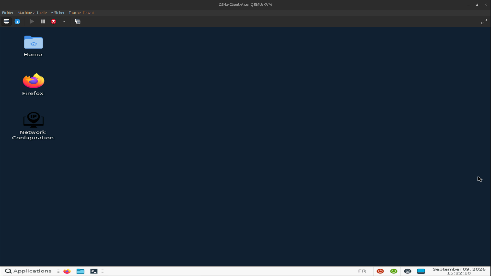
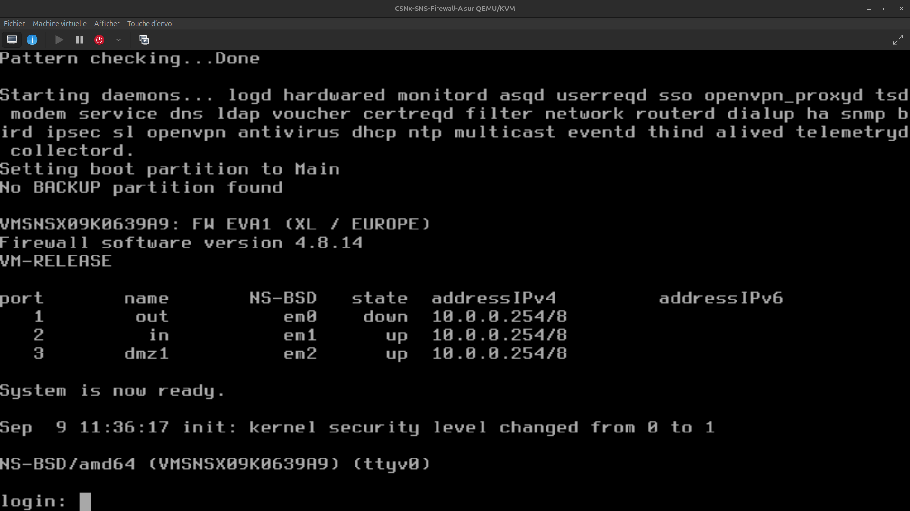

# Lab Stormshield — CSNx (Server + Client + Firewall)

Architecture de lab virtuelle pédagogique, déployée automatiquement par script sous
**QEMU/KVM + libvirt (virt-manager)** sur Ubuntu 24.04 Desktop. Elle instancie trois VM reliées
entre elles : un **firewall Stormshield Network Security (SNS)**, un **serveur** et un **client**.

Utilisée dans le cadre de mon activité de formateur officiel Stormshield, pour préparer mes labs
et fournir à mes élèves l'environnement pédagogique virtuel officiel de la Stormshield Academy.

« CSNx » est un nom générique à dessein : ce même lab sert de base à plusieurs formations
Stormshield (CSNA, CSNE, CSNR, CSNTS...), d'où des VM/réseaux nommés `CSNx` plutôt que d'après une
formation en particulier.

## Architecture

```
                    Internet (réel)
                         │
                    réseau 'default' (NAT, DHCP)
                         │
                  ┌──────┴──────┐
                  │  Firewall   │  out (WAN) - in (LAN) - dmz1 (DMZ)
                  │ Stormshield │
                  └──┬───────┬──┘
                     │       │
        LAN-<X>-CSNx │       │ DMZ-<X>-CSNx
        192.168.y.0/24       172.16.y.0/24
                     │       │
              ┌──────┴─┐   ┌─┴────────┐
              │ Client │   │  Server  │
              │(Alpine)│   │ (Debian) │
              └────────┘   └──────────┘
```

Chaque **compagnie** (= un lab isolé pour un binôme/étudiant/session) est identifiée par une
lettre (A, B, C...) et dispose de ses propres réseaux LAN/DMZ isolés. Le WAN de chaque firewall
sort sur le réseau libvirt `default`, partagé par toutes les compagnies.

| VM | OS invité | Rôle |
|---|---|---|
| `CSNx-SNS-Firewall-<X>` | Stormshield SNS 4.8.14 (FreeBSD) | Firewall — zones out/in/dmz1 |
| `CSNx-Server-<X>` | Debian 5.0.10 Lenny i386 | Serveur (DNS, mail, web, ftp...) côté DMZ |
| `CSNx-Client-<X>` | Alpine Linux 3.20 x86_64 + XFCE | Poste client côté LAN |

Détails complets (bus disque, RAM/vCPU, MAC, identifiants) dans [PROCEDURE.md](PROCEDURE.md).

## Prérequis

- Ubuntu 24.04 Desktop (ou distribution Linux équivalente) avec QEMU/KVM + libvirt + virt-manager
  installés et fonctionnels.
- Le réseau libvirt `default` (NAT) déjà actif sur l'hôte.
- Les 3 images maîtres qcow2 — voir section suivante, **non incluses dans ce dépôt**.

## Images maîtres — non incluses dans ce dépôt

Le dossier `masters/` attendu par le script n'est pas versionné ici, pour deux raisons :

1. **Taille** : les 3 images totalisent environ **5,3 Go** (Client 3,8 Go, Firewall 857 Mo,
   Serveur 730 Mo). GitHub bloque tout fichier de plus de 100 Mo sans Git LFS, et le stockage LFS
   gratuit ne couvre qu'1 Go — largement insuffisant ici.
2. **Licence** : `CSNx-SNS-Firewall.qcow2` exécute un firmware **Stormshield SNS** sous licence
   pédagogique **EVA1**, fournie aux formateurs Stormshield Academy. Ce firmware n'est pas
   redistribué via ce dépôt public.

Structure attendue avant de lancer `new-company-lab.sh` :

```
masters/
├── CSNx-Server.qcow2        (Debian 5.0.10 Lenny i386)
├── CSNx-Client.qcow2        (Alpine Linux 3.20 x86_64, XFCE)
└── CSNx-SNS-Firewall.qcow2  (Stormshield SNS 4.8.14, FreeBSD — disque en virtio obligatoire)
```

Procure-toi ces images via ton propre accès formateur Stormshield Academy (firewall) et réextrais
ou reconstruis les masters Server/Client selon ta propre installation. Voir [PROCEDURE.md](PROCEDURE.md)
§2 pour le détail de la conversion réalisée à l'origine (depuis un export OVA VirtualBox).

## Utilisation rapide

```bash
cd Lab-Stormshield
./new-company-lab.sh B              # crée la compagnie B (réseaux + 3 VM, numéro déduit de la lettre)
virsh start CSNx-Server-B
virsh start CSNx-SNS-Firewall-B
virsh start CSNx-Client-B
```

Nettoyage en fin de session :

```bash
./new-company-lab.sh B --remove        # VM + disques de la compagnie B (garde les réseaux)
./new-company-lab.sh B --remove-all    # VM + disques + réseaux LAN-B-CSNx/DMZ-B-CSNx
```

Les deux modes de suppression demandent une confirmation (`-y`/`--yes` pour l'éviter). Les images
maîtres ne sont jamais modifiées : chaque compagnie obtient un disque overlay qcow2 indépendant.

## Premier démarrage (par VM)

Étapes manuelles, à faire par le formateur/étudiant à chaque nouvelle session :

- **Serveur** : écran « Please select your company from the list below... » → choisir la lettre
  de l'instance. Identifiants : `user`/`user` ou `root`/`root`.
- **Client** : terminal Stormshield « WELCOME TO THE NETWORK CONFIGURATION TOOL » → `sns`,
  `a`–`x` (lettre de compagnie), `trainer`, `dhcp` ou `manual` selon le scénario. Session Alpine :
  `user`/`user`.
- **Firewall** : prompt `login:` (NS-BSD). Identifiants : `admin`/`admin`. L'interface WAN (`out`)
  est désactivée par défaut — comportement normal de Stormshield, à configurer selon le scénario
  de formation (voir documentation Stormshield officielle).

Détail complet, dépannage et schéma d'adressage : [PROCEDURE.md](PROCEDURE.md).

## Captures d'écran

| | |
|---|---|
|  Exécution du script |  VM créées automatiquement |
|  Choix de la compagnie (serveur) |  Configuration terminée (serveur) |
|  Configuration du client (choisir `sns` au début) |  Bureau du client |
|  Firewall en configuration par défaut | |

## Licence et usage pédagogique

Le script et la documentation de ce dépôt sont mon travail original. **Stormshield Network
Security** est un produit commercial de Stormshield ; le firmware du firewall utilisé dans ce lab
est fourni sous licence pédagogique (EVA1) aux formateurs Stormshield Academy et n'est pas inclus
dans ce dépôt. L'usage de cet environnement doit rester conforme à ton propre accord Stormshield
Academy / à ta licence.
